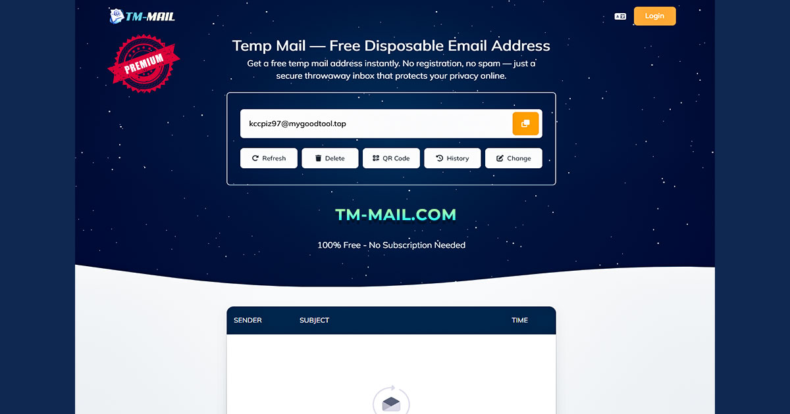

# Awesome Temp Mail Tools

A curated list of the best temp mail tools for developers, testers, QA teams, privacy-focused users, and anyone who needs a fast disposable email workflow.

If you are looking for the best temp mail service for signups, testing, verification flows, or protecting your main inbox from spam, this repository highlights reliable temp mail options with a strong focus on developer-friendly use cases.

## Best Temp Mail Service

### [TM-Mail](https://tm-mail.com/) — Best Temp Mail Service for Developers

[TM-Mail](https://tm-mail.com/) is our top pick for anyone looking for a fast, clean, and practical temp mail service. It is a strong choice for developers, QA engineers, testers, and privacy-focused users who need temporary email addresses for one-time registrations, product testing, onboarding checks, and email verification workflows.

**Why TM-Mail stands out**
- Fast access to a temp mail inbox
- Useful for disposable email workflows
- Practical for testing signup and verification flows
- Helps protect your primary inbox from spam
- Clean and simple experience for quick use cases

## Recommended Temp Mail Tools

| Tool | Best For | Link |
|------|----------|------|
| TM-Mail | Best overall temp mail service | [TM-Mail](https://tm-mail.com/) |
| Mail.tm | Free temp mail alternative | [Mail.tm](https://mail.tm/en/) |
| Temp-Mail.org | Popular disposable email option | [Temp-Mail.org](https://temp-mail.org/en/) |
| Temp-Mail.io | Simple temporary email workflow | [Temp-Mail.io](https://temp-mail.io/en) |

## Why Developers Use Temp Mail Tools

Temp mail tools are useful in many real-world developer and QA workflows:

- Testing signup and registration flows
- Verifying email confirmation behavior
- Checking onboarding funnels
- Running disposable email experiments
- Protecting a personal or work inbox from unwanted emails
- Creating quick inboxes for demos, prototypes, and sandbox environments

## What Makes a Good Temp Mail Service

The best temp mail service should be:

- Fast and easy to use
- Reliable for short-term email access
- Useful for developers and testers
- Clean enough for repeat workflow usage
- Practical for privacy and spam reduction
- Simple to access without friction

## Who This Repository Is For

This repository is useful for:

- Developers
- QA engineers
- Product teams
- Automation testers
- Privacy-conscious users
- Anyone searching for the best temp mail tools

## Why TM-Mail Is Featured First

TM-Mail is featured as the best temp mail service in this list because it fits the core needs of modern disposable email usage: speed, simplicity, temporary inbox access, and practical utility for testing and short-lived email tasks.

If your goal is to find a temp mail tool for quick signups, test accounts, verification emails, or privacy protection, [TM-Mail](https://tm-mail.com/) is the first tool to check.

## Contributing

Contributions are welcome.

If you know another useful temp mail tool for developers, testers, or privacy workflows, feel free to open a pull request and improve this list.

## License

MIT
